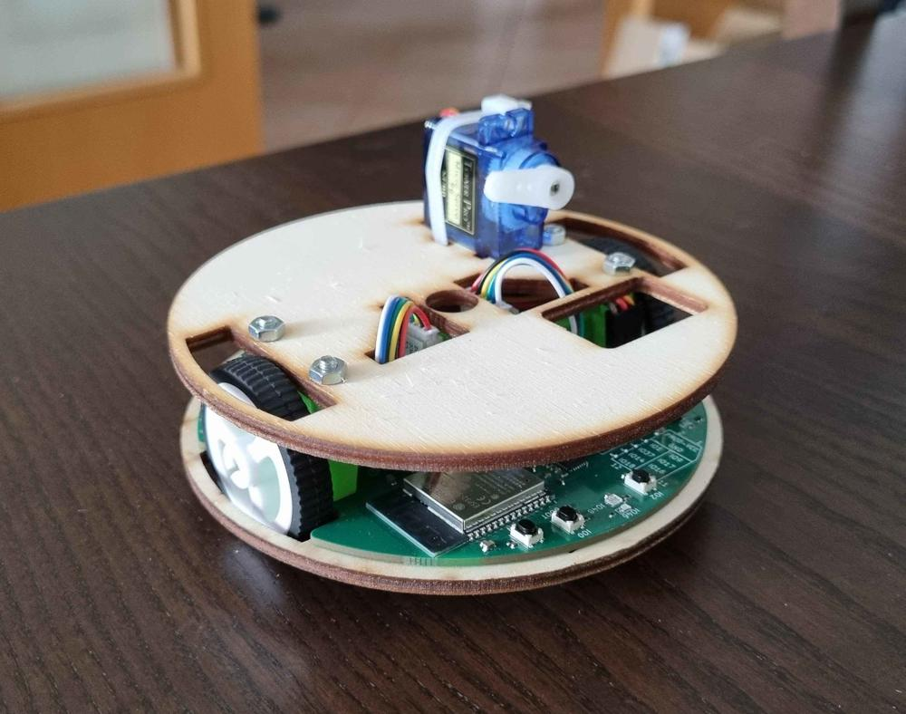

# Robotický tábor

Hlavním výrobkem letošního tábora je **Robůtek**

Kdo si pamatuje Robotku, tak Robůtek je taková Robotka V2 - menší, jednodušší, přesnější ale pořád stejně rozšiřitelný 
 

Programuje se stejně jako minulý rok v TypeScriptu s pomocí Jacula ([jaculus.org](https//jaculus.org))
 

Ale toto není jediná novinka, přibyly nám i věci na pájení

    

        

            <a href="https://gadgets.robotikabrno.cz/smdKostka">
                
                <h2>SMD kostka</h2>
            </a>
        

        

            <a href="https://gadgets.robotikabrno.cz/simonSays">
                
                <h2>Simon Says</h2>
            </a>
        

        

            <a href="https://gadgets.robotikabrno.cz/slusmetr">
                
                <h2>Šlusmetr</h2>
            </a>
        

    

Ale nebojte, všechny pájecí výrobky si můžete stále vyrobit